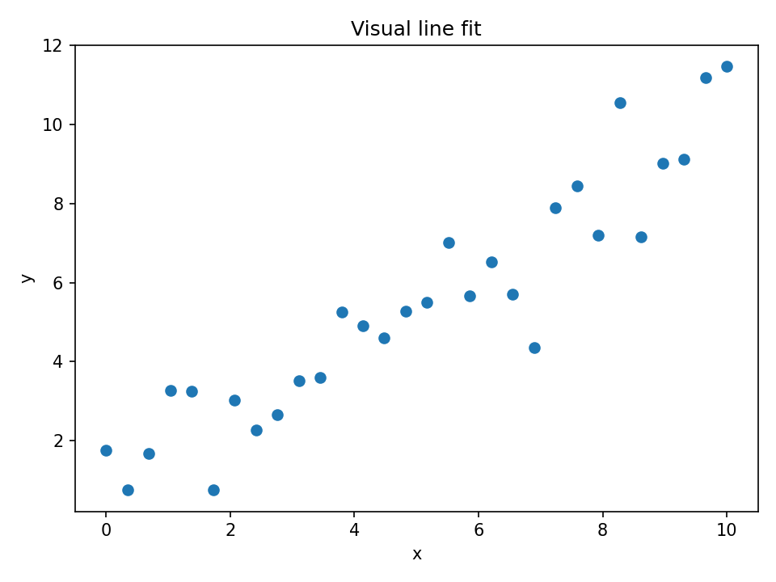
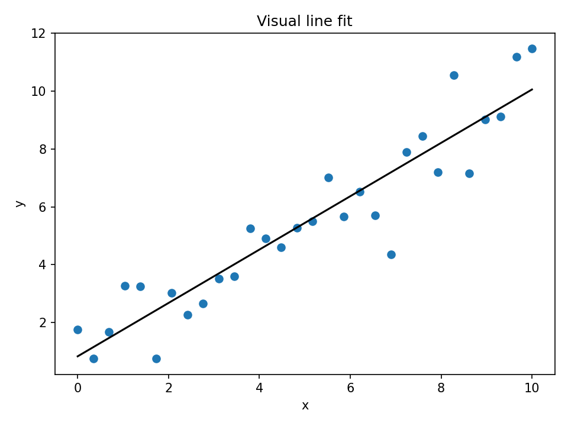
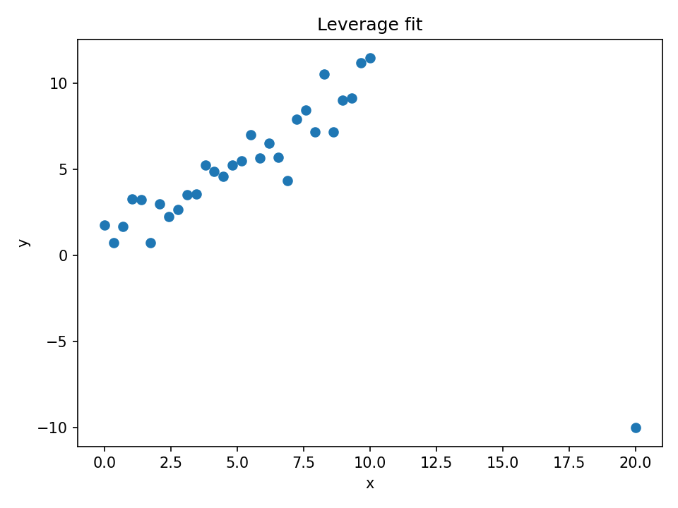
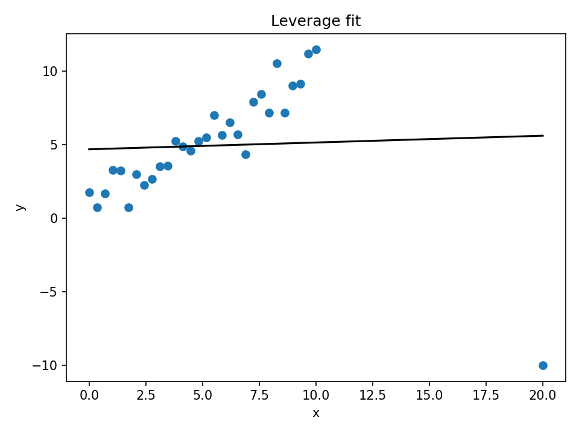

# Introduction to Supervised Machine Learning

### QLS–MiCM Workshop

**Instructor:** Jesse Islam
**Section:** Introduction 

---

## Workshop Overview

1. Introduction & Motivation.
2. Linear Regression.
3. Regularization.
4. Feature Engineering & Nonlinearity.
5. MLPs for Tabular Data.
6. Training Mechanics & Evaluation.
7. Mini Hackathon

---

## Why Machine Learning in Medicine?

- Large amounts of biomedical data:
  - Clinical measures, omics, imaging, EHRs.
- ML can:
  - **Predict** outcomes (e.g., risk, response).
  - **Identify** patterns and biomarkers.
  - **Support** clinical decisions.

---

# Exercise 00: Intro & Data Exploration

No modelling yet! Let's explore the data.

---

## What You Need to Know

**Supervised learning :**
- We have **features (X)** and a **target (y)**
- Our goal: learn a function of X that predicts y. `f(X)=y`
- Everything we do today follows this structure.

---

## Example 1: A Simple Linear Relationship

---

## Example 2: Linear Fit Through the Data

---

## Example 3: Adding a High-Leverage Point

---

## Example 4: How the Line Changes

---

## The Workflow We'll Use All Day

1. Load dataset.
2. Inspect structure (shape, head).
3. Explore variables (summary stats).
4. Visualize relationships in the data.
5. Train/test split.

You’ll repeat this in every later exercise to understand the data.

---

## Your First Dataset

Open the notebook:
**`00_intro_and_data_exploration.ipynb`**

You'll do:
- `df.head()`.
- `df.shape`.
- `df.describe()`.
- Plot histograms.
- Plot correlations.
- Identify potential predictors

Nothing model-related yet. Just understanding the data.

---

## Why Explore?

Before training any model, we will answer:

- What variables are there?
- Which features look related to the target?

Good exploration = better modeling later.
