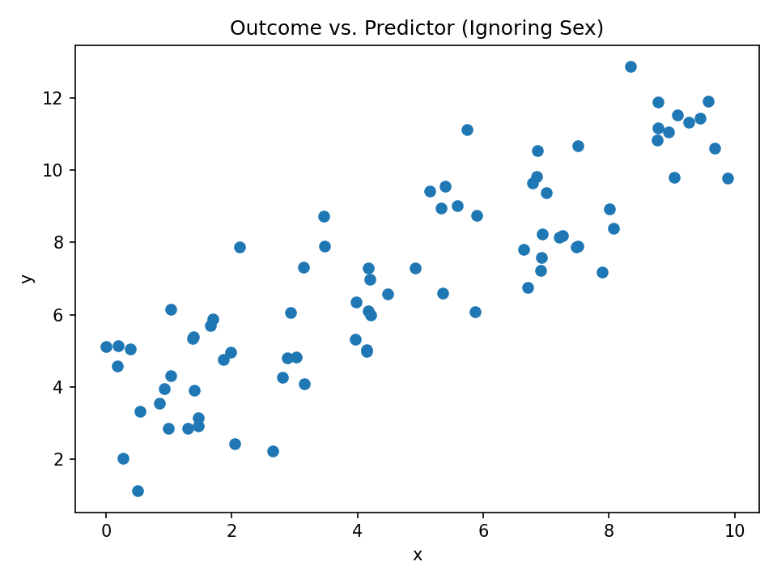
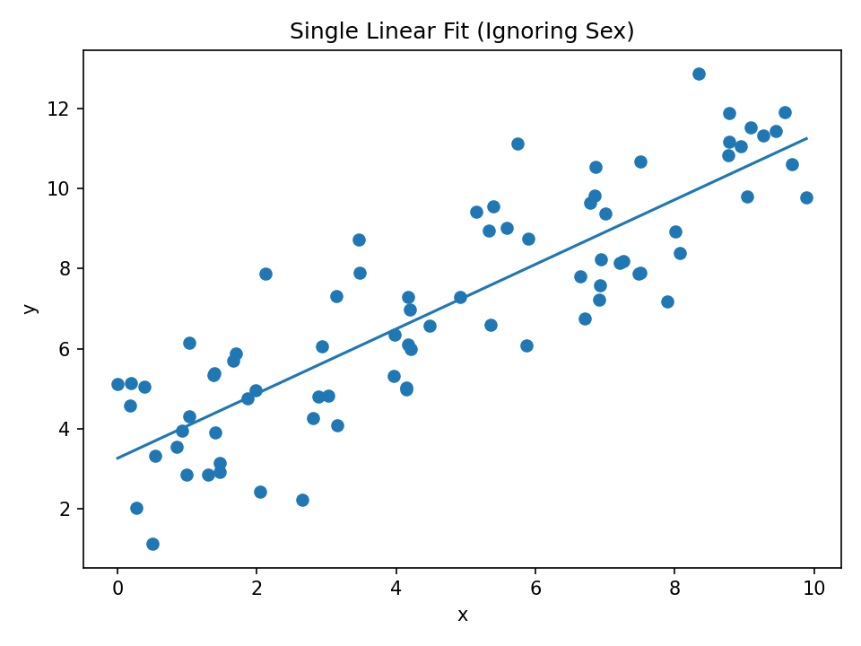
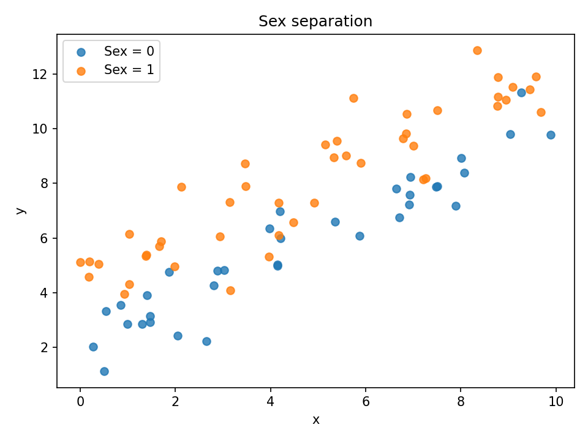
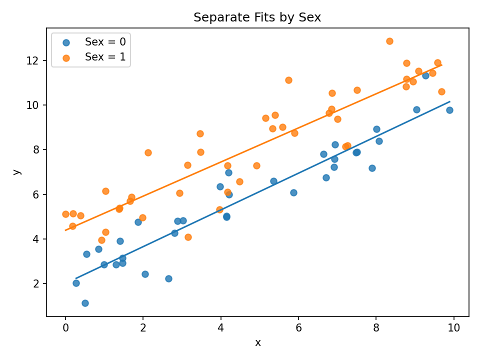

# Linear Regression 
QLS–MiCM Workshop

---

## Learning Goals

After this module, you will be able to:

- Fit linear regression models in Python.
- Interpret coefficients.
- Compare simple vs. multivariable models.
- Evaluate model fit.

---

# Why Linear Regression?

A common model in clinical research because:

- Interpretable coefficients. 
- Well suited for tabular data. 
- Often enough!

---

# What Linear Regression Does

$$y = \beta_0 + \beta_1 x_1 + ... + \beta_p x_p$$

- Predicts a **continuous** outcome (Gaussian). 
- coefficients ($\beta_p$): change in y for unit change in $x_p$.
- Assumes relationships are additive.

---

# Step 1: Start Simple

We begin with a model that uses **one predictor**.

$$y = \beta_0 + \beta_1 x_1$$

This helps us:

- Build intuition.
- Understand effect sizes.

---

# Step 2: Add More Predictors

Questions to consider:

- Do coefficients change?
- Does performance improve?
    - Is that improvement useful?

---

## Example 1: Outcome vs Predictor (Ignoring Sex)

---

## Example 2: Single Linear Fit (Ignoring Sex)

---

## Example 3: Sex as a Categorical Variable

---

## Example 4: Separate Regression Lines by Sex

---

# Step 3: When Predictors Relate to Each Other

- How does the model handle related predictors? 
- Are coefficients stable? 
- Does interpretation become easier or harder? 

---

# Evaluating the Model

You will compute:

**MAE**: Average prediction error.

**$R^2$**: How much variation in the outcome the model explains.
- What is “good enough”? 
- Do more predictors always help?

---

# Understanding Uncertainty

With `statsmodels`, you will look at:

- p-values.
- significance.

Consider:

- What makes a coefficient reliable? 
- How confident are we in each effect?

---

# Interaction Terms

You will also try adding an interaction term.

This shows how linear models can:

- represent relationships between predictors.
- become more expressive.

And raises questions like:

- When is this helpful? 
- When might it complicate interpretation?

---

# What You Will Do 

In the notebook, you will:

1. Fit a model using **one** predictor.
2. Fit a **multivariable** model.
3. Add an additional predictor.
4. Explore how the model behaves.
5. Compare evaluation metrics.
6. Examine uncertainty in coefficients.
7. Reflect on your findings.

