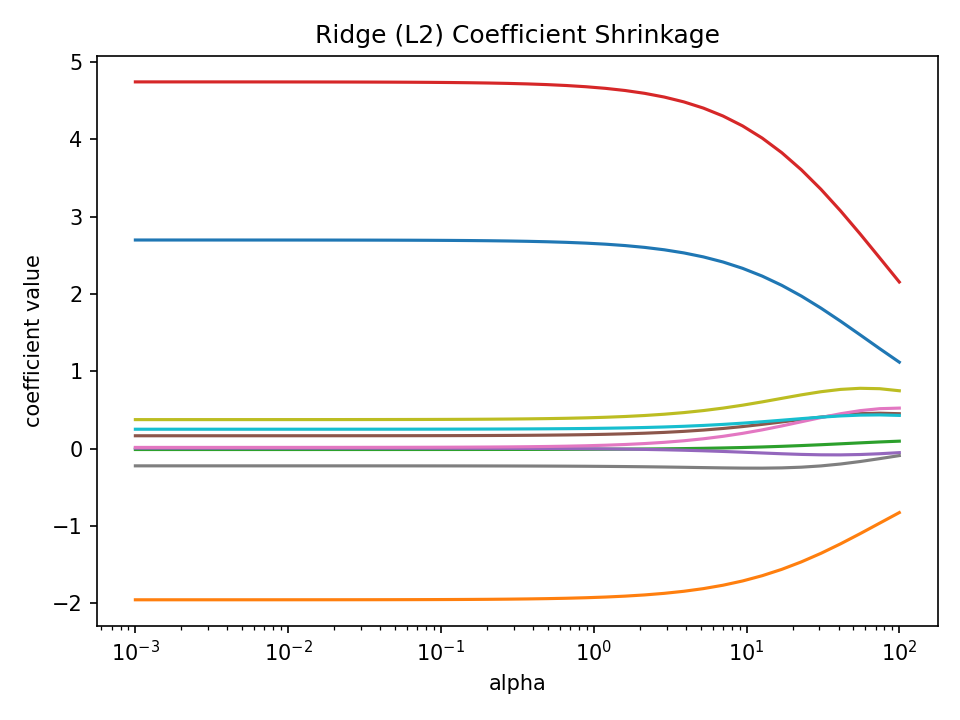
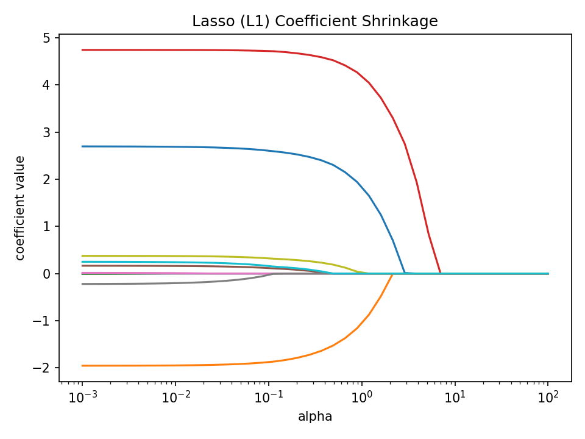

# Regularization in High-Dimensions

QLS–MiCM Workshop

---

# Why High-Dimensional Data Is Hard

Medical datasets, especially omics, often have:

- **Hundreds–thousands** of predictors.
- **Correlated** features. 
- **Small sample sizes** relative to features.

Ordinary linear regression struggles with:

- unstable coefficients.
- overfitting.
- poor generalization.

This motivates regularization.

---

# What Regularization Does

Regularization adds a **penalty** to large coefficients.

This encourages:

- smaller, more stable coefficients.
- less sensitivity to noise.
- better generalization on new data.

Two main types:

- **Ridge (L2):** shrinks all coefficients.
  - $$\hat{\beta}= \arg\min_{\beta}\left(\| y - X\beta \|_2^2\;+\;\lambda \| \beta \|_2^2\right)$$
- **Lasso (L1):** sets some coefficients to **zero**
  - $$\hat{\beta}= \arg\min_{\beta}\left(\| y - X\beta \|_2^2\;+\;\lambda \| \beta \|_1\right)$$

---

# Ridge Regression (L2)

Ridge: 
 $$\|\mathbf{x}\|_2 = \sqrt{\sum_{i=1}^{n} x_i^2}$$

- handles correlated predictors well.
- spreads weight across related features.
- improves stability without eliminating variables.

Key question to explore:
**Which features receive the most shrinkage?**

---

# Lasso Regression (L1)

Lasso:
 $$\|\mathbf{x}\|_1 = \sum_{i=1}^{n} |x_i|$$

- performs **automatic feature selection**.
- drives many coefficients exactly to **zero**.
- useful when features are redundant or weakly informative.

Key question to explore:
**Which features does Lasso keep, and why?**

---

## Ridge (L2) Coefficient Shrinkage

---

## Lasso (L1) Coefficient Shrinkage

---

# Cross-Validation for $\alpha$ (Regularization Strength)
- Splitting your dataset into a training and validation set.
- Cross-validation uses more splits.
- We use cross-validation to estimate regularization strength.
- $\lambda$ is the weight of the penalty ($\alpha$ is what scikit uses).