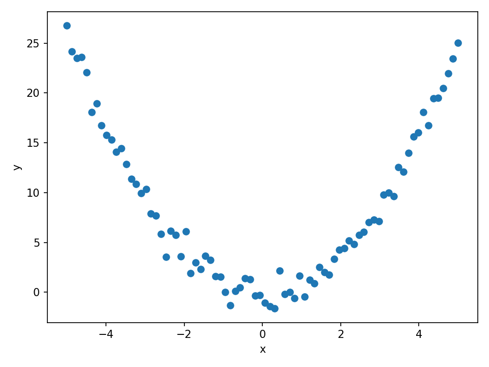
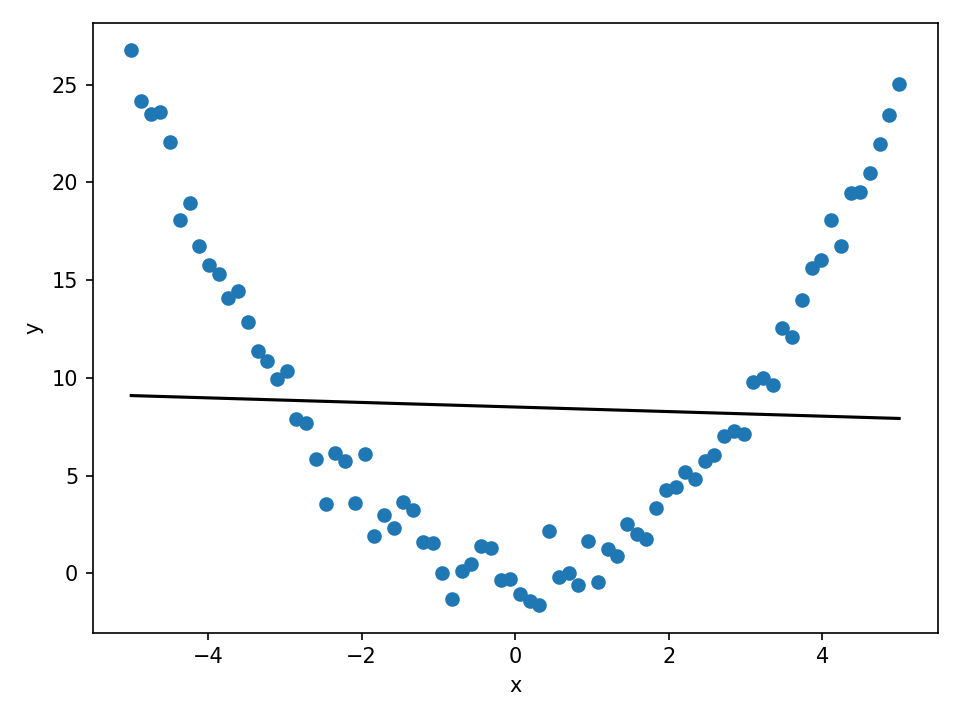
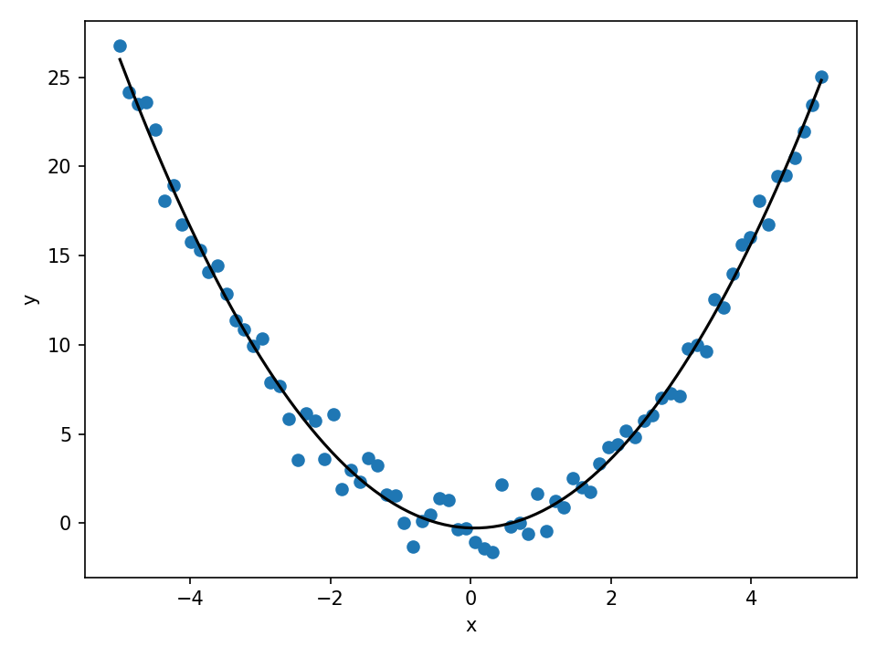
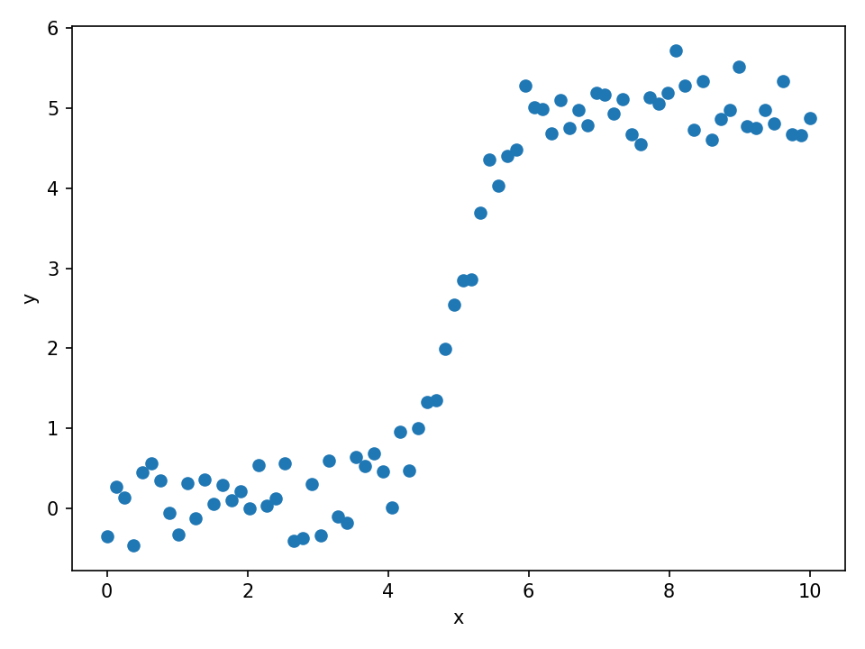
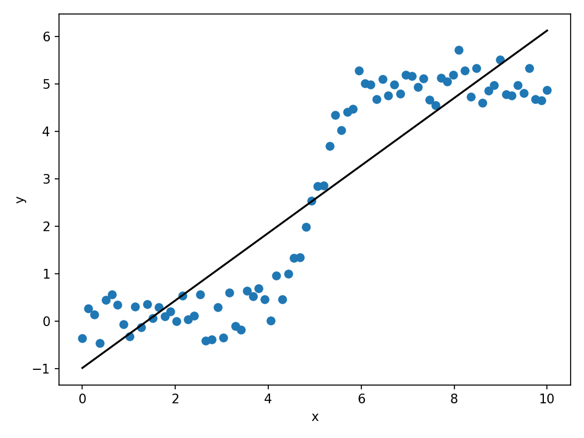
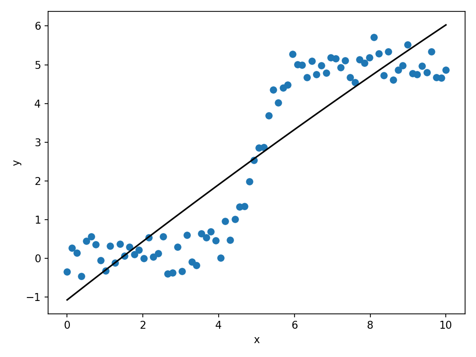
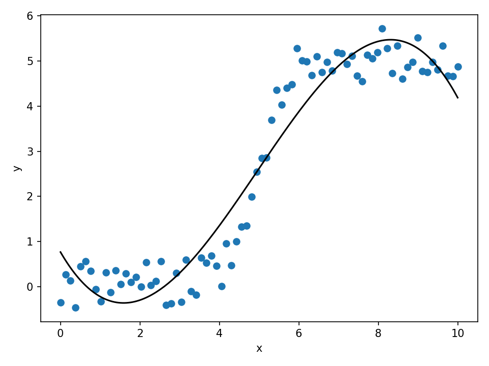

# Feature Engineering & Nonlinearity
QLS–MiCM Workshop

---

## Why This Matters

Real biological and clinical effects are **rarely linear**.

Examples:
- dose–response curves.
- saturation and thresholds.
- diminishing returns.
- nonlinear gene/protein interactions.

---

## Key Idea: Add Nonlinear Features

We keep using a **linear model**, but expand the input features:

### Polynomial Features
- $x^2$, $x^3$.
- interactions ($x_1x_1, x_1^2, x_2, ...$).
- allows curvature and richer patterns.

This is still simple, interpretable, fast.

---

## Parabolic Relationship (Point Cloud)

---

## Linear Fit on Parabolic Data (Underfitting)

---

## Quadratic Fit on Parabolic Data (Good Fit)

---

## S-Shaped Dose–Response (Point Cloud)

---

## Linear Fit on S-Shaped Dose–Response (Poor Fit)

---

## Quadratic Fit on S-Shaped Dose–Response (Closer Fit)

---

## Cubic Fit on S-Shaped Dose–Response (Best Polynomial Fit)

---

## Workflow You’ll Use 

1. Load the drug response dataset.
2. Fit a **baseline linear model**.
3. Add polynomial features (degree=???).
4. Compare model performance.
5. Visualize:
  - data vs linear fit.
  - data vs polynomial fit.

---

## What to Look For

- Do non-linear functions of $x$ improve MAE?
- Does the polynomial model better follow the data trend?
- Is the relationship between top predictor + effect nonlinear?
- When does added flexibility risk overfitting?
