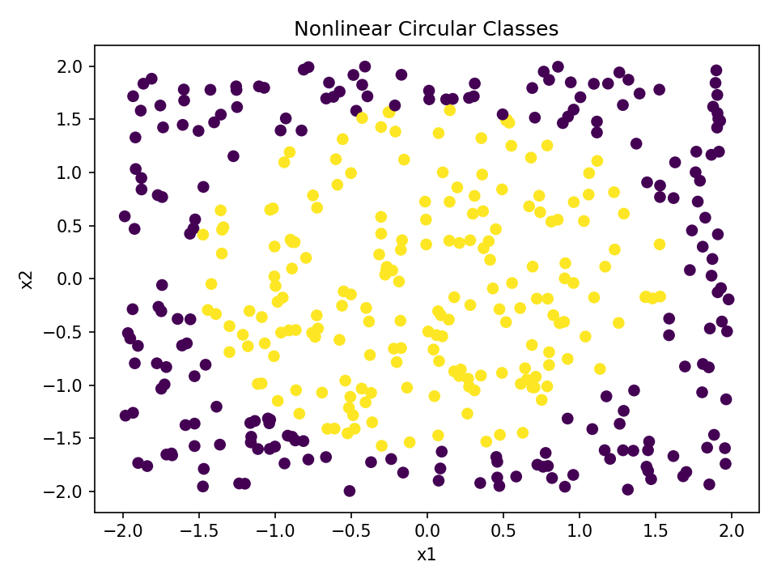
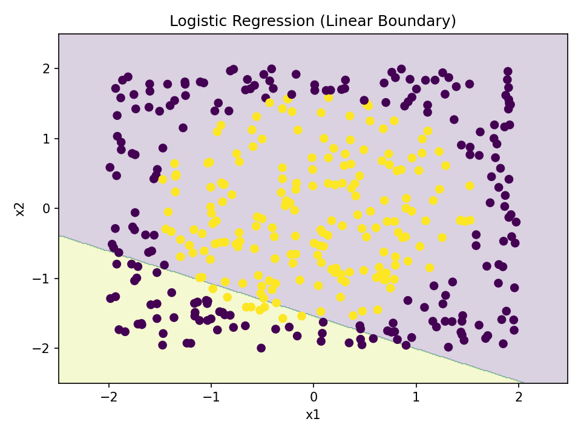
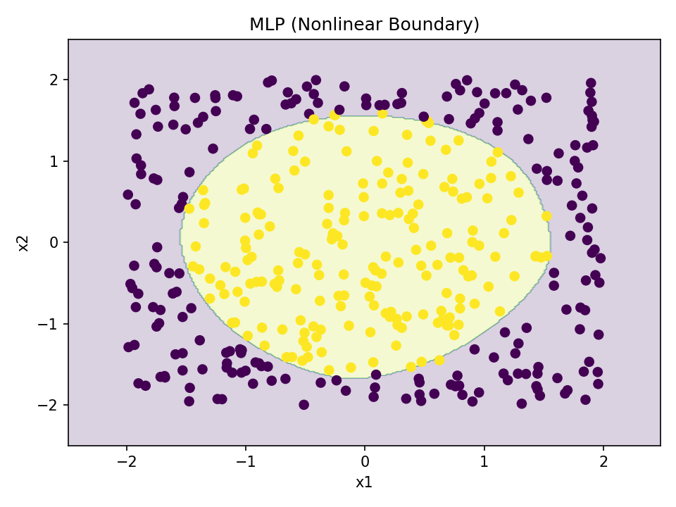
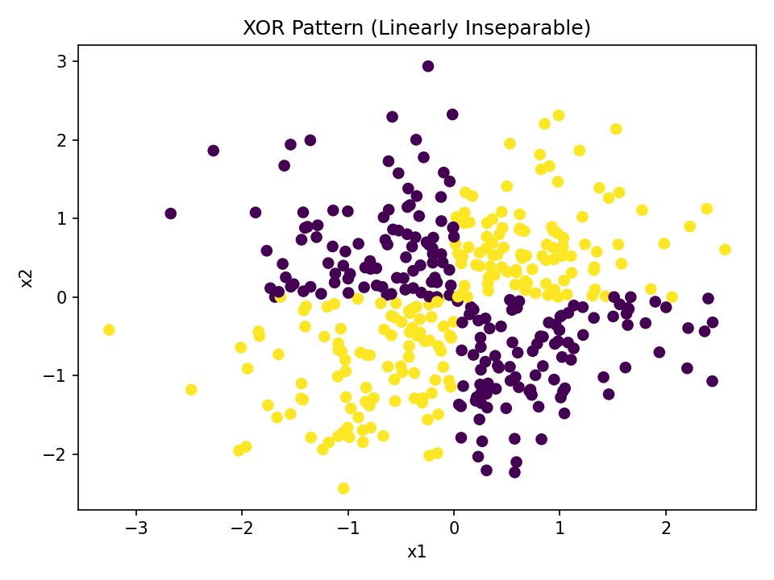
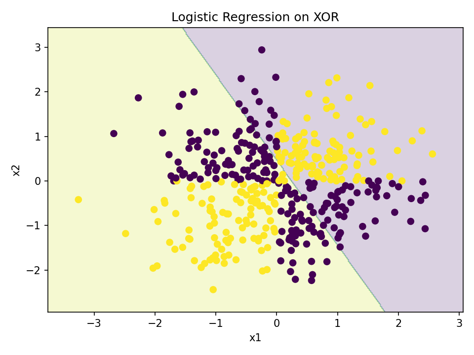
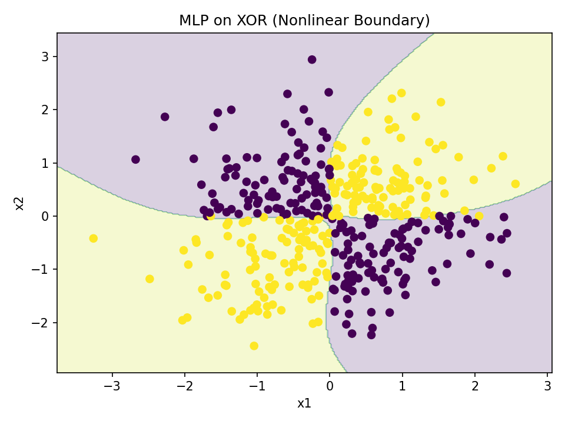

# Multilayer Perceptrons
QLS–MiCM Workshop

---

## Linear vs. Logistic Regression

**Linear regression**
- predicts a *continuous* value.
- output can be any real number.
- model:
  - $\hat{y} = X\beta$

**Logistic regression**
- predicts a *probability* (0–1).
- uses the sigmoid function.
  - $\hat{p} = \sigma(X\beta)$
- ideal for classification tasks.

Logistic is a linear model **passed through a probability link function**.

---

## Why Compare MLPs to Linear Models? 

Tabular data often has:

- few features.
- moderate sample size.
- mostly linear or monotonic relationships.

**Logistic regression is often hard to beat.**
MLPs help **only if** the data contain meaningful **nonlinear and/or interaction patterns**.

This exercise tests that idea.

---

## What an MLP Can Learn 

A multilayer perceptron can model:

- nonlinear boundaries.
- interactions between features.
- complex patterns missed by linear models.

But can also:

- overfit easily.
- require tuning (activation, layers, regularization).
- fail when data is simple or small.

You will explore both outcomes.

---

## Nonlinear Classes: Circular Pattern

The true classes form a **circle** — a nonlinear decision boundary.

---

## Logistic Regression on Circular Data

Logistic regression can draw only a **straight line**, so it cannot separate the inner vs outer region well.

---

## MLP on Circular Data

A small MLP can learn a **curved nonlinear boundary** that follows the circular structure.

---

## XOR Pattern: Linearly Inseparable

In XOR, the class depends on the **interaction** between the features (sign of x₁ × x₂).

No straight line can separate these classes.

---

## Logistic Regression on XOR

Logistic regression tries to split the space with a **single line**, which misclassifies entire quadrants.

---

## MLP on XOR

An MLP easily learns a **nonlinear boundary** that wraps around the quadrants.

---

## The Baseline: Logistic Regression

Logistic regression is:

- linear.
- stable.
- interpretable.
- often the best model.

---

## What You Will Change in the MLP

You will experiment with:

- **Architecture**
  - number of layers/neurons `(e.g., (8,), (32,16), (100,100))`.

- **Activation Functions**
  - `relu` / `tanh` /`identity`.
- **Regularization**
  - adjust `alpha` (acts like L2 by default).
- **Training Settings**
  - increase `max_iter`.
Goal: **Can you make the MLP outperform logistic regression?**

---

## How You Will Evaluate

Using `classification_report`:

- **Accuracy** - correctness.
- **Precision** - false-alarm.
- **Recall** - disease-detection.
- **F1-score** - balance of precision + recall.

Key question:.
**Does added model complexity improve clinically meaningful metrics?**

